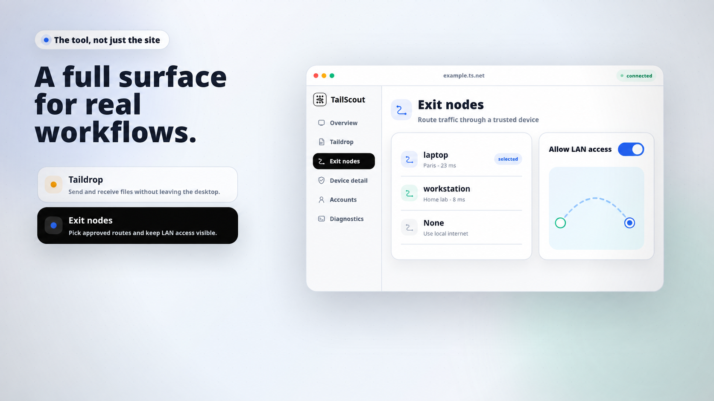

# TailScout

A clean, **native desktop GUI for Tailscale**. Linux uses Rust with GTK4 +
libadwaita; current-source native WinUI 3 and SwiftUI previews live beside it.

Tailscale now provides an [official Linux system tray in
beta](https://tailscale.com/docs/features/client/linux-systray) for common tray
actions. TailScout is an independent, low-footprint native workbench with a broader
at-a-glance tailnet view: inspect devices, connect or disconnect, manage accounts and
exit nodes, run diagnostics, and send or receive files over Taildrop — without using
the terminal for routine workflows.

**Built native.** TailScout is written in Rust and uses GTK4 + libadwaita — the same
toolkit GNOME itself uses. No Electron, no web views, no bundled browser engine.
Release builds are checked for a low runtime footprint. Linux PSS and OS shared-memory overhead are tracked separately, and helper commands are centralized in
[`docs/runtime-footprint.md`](docs/runtime-footprint.md).

**Works across Linux desktops.** GTK4 runs natively on GNOME, KDE Plasma, XFCE,
Cinnamon, MATE, Budgie, and tiling compositors (i3, Sway, Hyprland). That covers the
vast majority of Linux desktop users. On GNOME it looks perfectly at home. On KDE and
others it renders its own Adwaita chrome — it won't match Breeze pixel-for-pixel, but
it works correctly and KDE's `breeze-gtk` package helps it blend in.

> Status: early (v0.1). Linux is the verified primary client. Windows WinUI 3
> and macOS SwiftUI clients are previews under active validation.

## Showcase

[](docs/assets/tailscout-showcase.mp4)

Watch TailScout in motion: native Linux Tailscale controls, Taildrop, exit-node selection, account context, live health, and a visual tailnet map in a 36-second project showcase.

Music bed: original generated synth track for this project video.

## Quick install (Linux)

Install the latest GitHub Release:

```bash
curl -fsSL https://raw.githubusercontent.com/shreyam1008/tailScout/main/scripts/install.sh | bash
```

The installer downloads the latest `tailscout-linux-x86_64.tar.gz` release asset,
detects existing installs, upgrades old versions automatically, refreshes launcher
metadata, and installs:

- **Binary:** `/usr/local/bin/tailscout`
- **Desktop launcher:** `/usr/local/share/applications/dev.shre.TailScout.desktop`
- **App icon:** `/usr/local/share/icons/hicolor/scalable/apps/dev.shre.TailScout.svg`

It uses `sudo` only if those system directories are not writable or if GTK4/libadwaita
runtime packages are missing. TailScout still needs Tailscale itself installed and
running.

## Features (v0.1)

- See your tailnet devices with online status, OS, and Tailscale IP
- Connect / disconnect (`tailscale up` / `down`)
- Set operator permission through the native Polkit password prompt
- View tailnet, signed-in user, MagicDNS, health, and Tailscale version
- Login, logout, and switch saved Tailscale accounts/tailnets
- Per-device detail: owner, IPs, routes, endpoint, relay, last seen, key expiry, traffic
- Send files to Taildrop-capable devices and receive Taildrop inbox files
- Save a default Taildrop receive folder in a tiny XDG config file
- View/select approved exit nodes and advertise this device as an exit node
- Help menu with app guide, CLI cheatsheet, netcheck, admin console, version, bugreport, and about
- Copyable command output/error dialogs for troubleshooting
- Live status refresh
- Auto version-matched: TailScout reads the running daemon's version

## Requirements

- A running `tailscaled` and the `tailscale` CLI in `$PATH`
- The current user set as operator (so the GUI can act without root). TailScout can open the native password prompt for this, or you can run:

  ```bash
  sudo tailscale set --operator=$USER
  ```

- Build deps: `libgtk-4-dev`, `libadwaita-1-dev`, `build-essential`, `pkg-config`

## Runtime footprint

TailScout is optimized for low memory in its baseline workflow. Current smoke-test
targets are:

- Linux GTK/libadwaita: `100 MiB` PSS release-target, plus `260 MiB` CI headless baseline
- macOS SwiftUI: `120 MiB` RSS
- Windows WinUI 3: `180 MiB` peak working set (interactive desktop only)

PSS/RSS/working set are different metrics, so compare them only within the same
platform and environment. See [`docs/runtime-footprint.md`](docs/runtime-footprint.md) for
the exact commands and latest observed values.

## Build & run

The local release binary is created at:

```text
target/release/tailscout
```

`target/` is gitignored on purpose. Do **not** commit compiled binaries to `main`;
GitHub Actions builds them from source and uploads them to GitHub Releases.

```bash
cargo run --release
```

To build and package a local release archive:

```bash
scripts/package-release.sh
```

This creates local artifacts under `dist/`:

- `tailscout-linux-x86_64.tar.gz`
- `tailscout-v<version>-linux-x86_64.tar.gz`
- `SHA256SUMS`

`dist/` is also gitignored because release files belong in GitHub Releases.

## Release process

Every push or pull request to `main` runs CI:

```bash
cargo fmt --all -- --check
cargo test --locked --all-targets
cargo clippy --locked --all-targets -- -D warnings
cargo build --locked
```

To publish a release:

```bash
git checkout main
git pull
scripts/tag-release.sh
```

That creates and pushes a tag like `vX.Y.Z`. GitHub Actions then builds the optimized
Linux, Windows, and macOS assets, publishes a GitHub Release, and uploads checksums.

Package-manager installs (`.deb`, RPM, AUR, Flatpak, distro repos, app stores) are
planned later. For now the supported install path is the GitHub Release installer above.

## Native Windows and macOS clients

TailScout keeps each desktop shell native:

- Linux: Rust + GTK4/libadwaita in `src/ui/`
- Windows: C# + WinUI 3 in `platform/windows/`
- macOS: SwiftPM + SwiftUI in `platform/macos/`

The Windows and macOS clients use the Tailscale CLI for parity with the Linux
backend: status, connect/disconnect, login/logout, saved profile switching,
exit-node controls, Taildrop send/receive, and diagnostics.

Build notes:

```powershell
cd platform\windows
dotnet restore .\TailScout.Windows.sln
dotnet test .\TailScout.Windows.Tests\TailScout.Windows.Tests.csproj -c Release
dotnet build .\TailScout.Windows\TailScout.Windows.csproj -c Release -p:Platform=x64
```

```bash
cd platform/macos
swift test
SIGNING_MODE=adhoc Scripts/package_app.sh release
open .build/app/TailScout.app
```

See [`docs/native-platforms.md`](docs/native-platforms.md) for platform API notes
and current limitations.

## Website

The lightweight landing page lives in [`docs/`](docs/). It is a static GitHub Pages
site with no build step. The page uses Tailwind via CDN, a tiny local JavaScript
file, and SEO/discovery files including `robots.txt`, `sitemap.xml`, `llms.txt`,
`llms-full.txt`, and `site.webmanifest`.

The public product site is <https://tailscout.shreyam1008.com.np/>.

To publish it, enable GitHub Pages in the repository settings:

- **Source:** Deploy from a branch
- **Branch:** `main`
- **Folder:** `/docs`

## Architecture

- `src/tailscale/` — pure, unit-tested client + data models (CLI wrapper + LocalAPI socket reader)
- `src/settings.rs` — tiny XDG config helper for local preferences
- `src/ui/` — thin libadwaita view layer, with window concerns split under `src/ui/window/`
- `platform/windows/` — pure C# core, focused WinUI partials, and backend/command tests
- `platform/macos/` — pure Swift core, focused SwiftUI views/view-model extensions, and tests
- `shared/` — the cross-platform behavior contract and canonical JSON fixtures
- `tests/` — Rust parsing and integration tests using the shared fixtures

See `AGENTS.md` for contributor rules, `shared/README.md` for the behavior/UI contract,
`CONTRIBUTING.md` for how to contribute, and `CHANGELOG.md` for version history.

## Contributing

Bug reports, ideas, and pull requests are all welcome. See [CONTRIBUTING.md](CONTRIBUTING.md).

## License

MIT — Copyright (c) 2026 Shreyam Adhikari. See [LICENSE](LICENSE).
